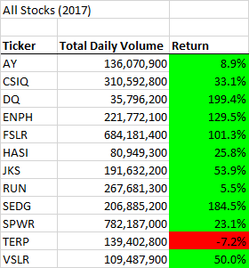
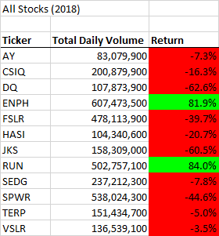
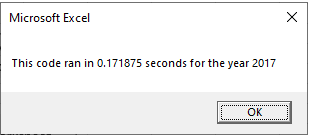
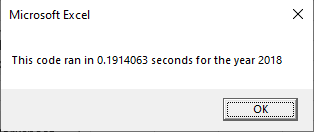
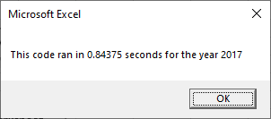
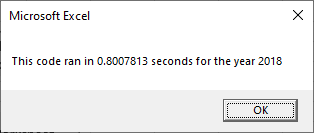
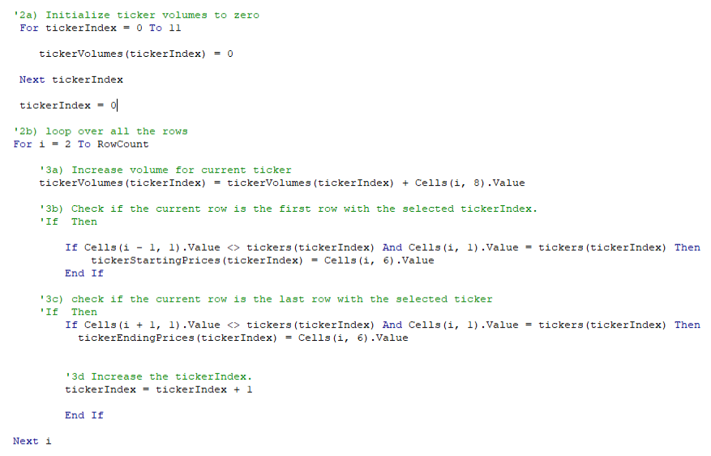

# **VBA Challenge**

## Overview of Project
  * There were two main purposes of this project. The first was to evaluate the performance of group of stocks from the beginning to the end of 2017 and 2018. Second purpose was       to develope code that would perform at a high level to analyze thousands of stocks in the future.
  
## Results
  ### Stock Performance
  * When look at the performace of the stocks there are several take aways of note. When looking at just 2017, there was only one stock, TERP, and had a negative return. When         looking at just 2018, only two stocks had a positive return, ENPH and RUN. ENPH and RUN are the only two stocks that had a positive return for both years. 
  
     
     
     
   ### Script Performance
   * The execution time for the refractored script was improved over the time for the original script, as can be seen in the screenshots taken below. The refractored sprict            produced results for 2017 about 0.672 seconds faster than the original script did, and about 0.609 seconds faster for 2018.
   
   
      Refractored Script Results
      
      
      
      
      Original Script Results
  
      
      
      
     * The main improvement came from utilizing a tickerIndex within the code. It took away the need for a nested loop which, in turn, sped up the execution time.
    
    
## Summary
  ### Advantages and Disadvantages of Refactoring Code
  * The advantage of refactoring code is that it can help with time. Tweaking code can help improve execution times on current scripts and projects. Refractoring code can also       help save time on new projects. Adjusting previously exisitng code to fit a new project will be faster than creating an entirly new script from scratch.
  * The disadvantage of refactoring code is at times the gains made in speeding up execution time may not be worth the main power and time that went into refactoring the code.
  
  ### Advantages and Disadvantages of the Original and Refactored VBA Script
  * The advantage of the refactored script is that it sped up the execution time, which would provide beneficial when looping through large data sets.
  * The disadvantage of the refactored code is the extra time that went into creating it for less than a second improvement on the current data set. Time was spent on improving     working code for the possibility of the codes potential use in the future.
  * The advantage of the original code is that it worked and potentially code be easier to understand at first glance to someone new.
  * The disadvantage of the original code is that it is slower than the new code and that lag would have only increased with larger data sets.
